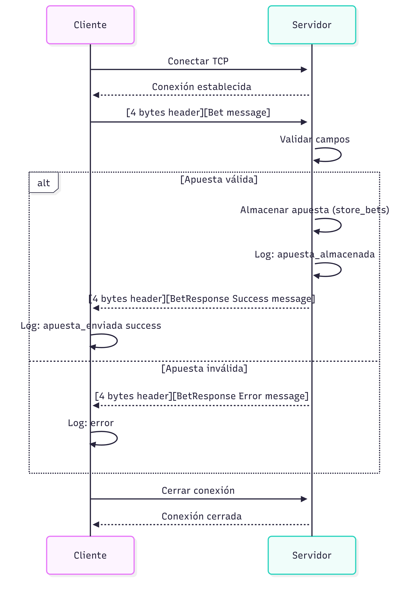

# TP0: Docker + Comunicaciones + Concurrencia

En el presente repositorio se provee un esqueleto básico de cliente/servidor, en donde todas las dependencias del mismo se encuentran encapsuladas en containers. Los alumnos deberán resolver una guía de ejercicios incrementales, teniendo en cuenta las condiciones de entrega descritas al final de este enunciado.

 El cliente (Golang) y el servidor (Python) fueron desarrollados en diferentes lenguajes simplemente para mostrar cómo dos lenguajes de programación pueden convivir en el mismo proyecto con la ayuda de containers, en este caso utilizando [Docker Compose](https://docs.docker.com/compose/).

## Instrucciones de uso
El repositorio cuenta con un **Makefile** que incluye distintos comandos en forma de targets. Los targets se ejecutan mediante la invocación de:  **make \<target\>**. Los target imprescindibles para iniciar y detener el sistema son **docker-compose-up** y **docker-compose-down**, siendo los restantes targets de utilidad para el proceso de depuración.

Los targets disponibles son:

| target  | accion  |
|---|---|
|  `docker-compose-up`  | Inicializa el ambiente de desarrollo. Construye las imágenes del cliente y el servidor, inicializa los recursos a utilizar (volúmenes, redes, etc) e inicia los propios containers. |
| `docker-compose-down`  | Ejecuta `docker-compose stop` para detener los containers asociados al compose y luego  `docker-compose down` para destruir todos los recursos asociados al proyecto que fueron inicializados. Se recomienda ejecutar este comando al finalizar cada ejecución para evitar que el disco de la máquina host se llene de versiones de desarrollo y recursos sin liberar. |
|  `docker-compose-logs` | Permite ver los logs actuales del proyecto. Acompañar con `grep` para lograr ver mensajes de una aplicación específica dentro del compose. |
| `docker-image`  | Construye las imágenes a ser utilizadas tanto en el servidor como en el cliente. Este target es utilizado por **docker-compose-up**, por lo cual se lo puede utilizar para probar nuevos cambios en las imágenes antes de arrancar el proyecto. |
| `build` | Compila la aplicación cliente para ejecución en el _host_ en lugar de en Docker. De este modo la compilación es mucho más veloz, pero requiere contar con todo el entorno de Golang y Python instalados en la máquina _host_. |

### Servidor

Se trata de un "echo server", en donde los mensajes recibidos por el cliente se responden inmediatamente y sin alterar. 

Se ejecutan en bucle las siguientes etapas:

1. Servidor acepta una nueva conexión.
2. Servidor recibe mensaje del cliente y procede a responder el mismo.
3. Servidor desconecta al cliente.
4. Servidor retorna al paso 1.


### Cliente
 se conecta reiteradas veces al servidor y envía mensajes de la siguiente forma:
 
1. Cliente se conecta al servidor.
2. Cliente genera mensaje incremental.
3. Cliente envía mensaje al servidor y espera mensaje de respuesta.
4. Servidor responde al mensaje.
5. Servidor desconecta al cliente.
6. Cliente verifica si aún debe enviar un mensaje y si es así, vuelve al paso 2.

### Ejemplo

Al ejecutar el comando `make docker-compose-up`  y luego  `make docker-compose-logs`, se observan los siguientes logs:

```
client1  | 2024-08-21 22:11:15 INFO     action: config | result: success | client_id: 1 | server_address: server:12345 | loop_amount: 5 | loop_period: 5s | log_level: DEBUG
client1  | 2024-08-21 22:11:15 INFO     action: receive_message | result: success | client_id: 1 | msg: [CLIENT 1] Message N°1
server   | 2024-08-21 22:11:14 DEBUG    action: config | result: success | port: 12345 | listen_backlog: 5 | logging_level: DEBUG
server   | 2024-08-21 22:11:14 INFO     action: accept_connections | result: in_progress
server   | 2024-08-21 22:11:15 INFO     action: accept_connections | result: success | ip: 172.25.125.3
server   | 2024-08-21 22:11:15 INFO     action: receive_message | result: success | ip: 172.25.125.3 | msg: [CLIENT 1] Message N°1
server   | 2024-08-21 22:11:15 INFO     action: accept_connections | result: in_progress
server   | 2024-08-21 22:11:20 INFO     action: accept_connections | result: success | ip: 172.25.125.3
server   | 2024-08-21 22:11:20 INFO     action: receive_message | result: success | ip: 172.25.125.3 | msg: [CLIENT 1] Message N°2
server   | 2024-08-21 22:11:20 INFO     action: accept_connections | result: in_progress
client1  | 2024-08-21 22:11:20 INFO     action: receive_message | result: success | client_id: 1 | msg: [CLIENT 1] Message N°2
server   | 2024-08-21 22:11:25 INFO     action: accept_connections | result: success | ip: 172.25.125.3
server   | 2024-08-21 22:11:25 INFO     action: receive_message | result: success | ip: 172.25.125.3 | msg: [CLIENT 1] Message N°3
client1  | 2024-08-21 22:11:25 INFO     action: receive_message | result: success | client_id: 1 | msg: [CLIENT 1] Message N°3
server   | 2024-08-21 22:11:25 INFO     action: accept_connections | result: in_progress
server   | 2024-08-21 22:11:30 INFO     action: accept_connections | result: success | ip: 172.25.125.3
server   | 2024-08-21 22:11:30 INFO     action: receive_message | result: success | ip: 172.25.125.3 | msg: [CLIENT 1] Message N°4
server   | 2024-08-21 22:11:30 INFO     action: accept_connections | result: in_progress
client1  | 2024-08-21 22:11:30 INFO     action: receive_message | result: success | client_id: 1 | msg: [CLIENT 1] Message N°4
server   | 2024-08-21 22:11:35 INFO     action: accept_connections | result: success | ip: 172.25.125.3
server   | 2024-08-21 22:11:35 INFO     action: receive_message | result: success | ip: 172.25.125.3 | msg: [CLIENT 1] Message N°5
client1  | 2024-08-21 22:11:35 INFO     action: receive_message | result: success | client_id: 1 | msg: [CLIENT 1] Message N°5
server   | 2024-08-21 22:11:35 INFO     action: accept_connections | result: in_progress
client1  | 2024-08-21 22:11:40 INFO     action: loop_finished | result: success | client_id: 1
client1 exited with code 0
```


## Parte 1: Introducción a Docker
En esta primera parte del trabajo práctico se plantean una serie de ejercicios que sirven para introducir las herramientas básicas de Docker que se utilizarán a lo largo de la materia. El entendimiento de las mismas será crucial para el desarrollo de los próximos TPs.

### Ejercicio N°1:
Definir un script de bash `generar-compose.sh` que permita crear una definición de Docker Compose con una cantidad configurable de clientes.  El nombre de los containers deberá seguir el formato propuesto: client1, client2, client3, etc. 

El script deberá ubicarse en la raíz del proyecto y recibirá por parámetro el nombre del archivo de salida y la cantidad de clientes esperados:

`./generar-compose.sh docker-compose-dev.yaml 5`

Considerar que en el contenido del script pueden invocar un subscript de Go o Python:

```
#!/bin/bash
echo "Nombre del archivo de salida: $1"
echo "Cantidad de clientes: $2"
python3 mi-generador.py $1 $2
```

En el archivo de Docker Compose de salida se pueden definir volúmenes, variables de entorno y redes con libertad, pero recordar actualizar este script cuando se modifiquen tales definiciones en los sucesivos ejercicios.

### Ejercicio N°2:
Modificar el cliente y el servidor para lograr que realizar cambios en el archivo de configuración no requiera reconstruír las imágenes de Docker para que los mismos sean efectivos. La configuración a través del archivo correspondiente (`config.ini` y `config.yaml`, dependiendo de la aplicación) debe ser inyectada en el container y persistida por fuera de la imagen (hint: `docker volumes`).


### Ejercicio N°3:
Crear un script de bash `validar-echo-server.sh` que permita verificar el correcto funcionamiento del servidor utilizando el comando `netcat` para interactuar con el mismo. Dado que el servidor es un echo server, se debe enviar un mensaje al servidor y esperar recibir el mismo mensaje enviado.

En caso de que la validación sea exitosa imprimir: `action: test_echo_server | result: success`, de lo contrario imprimir:`action: test_echo_server | result: fail`.

El script deberá ubicarse en la raíz del proyecto. Netcat no debe ser instalado en la máquina _host_ y no se pueden exponer puertos del servidor para realizar la comunicación (hint: `docker network`). `


### Ejercicio N°4:
Modificar servidor y cliente para que ambos sistemas terminen de forma _graceful_ al recibir la signal SIGTERM. Terminar la aplicación de forma _graceful_ implica que todos los _file descriptors_ (entre los que se encuentran archivos, sockets, threads y procesos) deben cerrarse correctamente antes que el thread de la aplicación principal muera. Loguear mensajes en el cierre de cada recurso (hint: Verificar que hace el flag `-t` utilizado en el comando `docker compose down`).

## Parte 2: Repaso de Comunicaciones

Las secciones de repaso del trabajo práctico plantean un caso de uso denominado **Lotería Nacional**. Para la resolución de las mismas deberá utilizarse como base el código fuente provisto en la primera parte, con las modificaciones agregadas en el ejercicio 4.

### Ejercicio N°5:
Modificar la lógica de negocio tanto de los clientes como del servidor para nuestro nuevo caso de uso.

#### Cliente
Emulará a una _agencia de quiniela_ que participa del proyecto. Existen 5 agencias. Deberán recibir como variables de entorno los campos que representan la apuesta de una persona: nombre, apellido, DNI, nacimiento, numero apostado (en adelante 'número'). Ej.: `NOMBRE=Santiago Lionel`, `APELLIDO=Lorca`, `DOCUMENTO=30904465`, `NACIMIENTO=1999-03-17` y `NUMERO=7574` respectivamente.

Los campos deben enviarse al servidor para dejar registro de la apuesta. Al recibir la confirmación del servidor se debe imprimir por log: `action: apuesta_enviada | result: success | dni: ${DNI} | numero: ${NUMERO}`.


#### Servidor
Emulará a la _central de Lotería Nacional_. Deberá recibir los campos de la cada apuesta desde los clientes y almacenar la información mediante la función `store_bet(...)` para control futuro de ganadores. La función `store_bet(...)` es provista por la cátedra y no podrá ser modificada por el alumno.
Al persistir se debe imprimir por log: `action: apuesta_almacenada | result: success | dni: ${DNI} | numero: ${NUMERO}`.

#### Comunicación:
Se deberá implementar un módulo de comunicación entre el cliente y el servidor donde se maneje el envío y la recepción de los paquetes, el cual se espera que contemple:
* Definición de un protocolo para el envío de los mensajes.
* Serialización de los datos.
* Correcta separación de responsabilidades entre modelo de dominio y capa de comunicación.
* Correcto empleo de sockets, incluyendo manejo de errores y evitando los fenómenos conocidos como [_short read y short write_](https://cs61.seas.harvard.edu/site/2018/FileDescriptors/).


### Ejercicio N°6:
Modificar los clientes para que envíen varias apuestas a la vez (modalidad conocida como procesamiento por _chunks_ o _batchs_). 
Los _batchs_ permiten que el cliente registre varias apuestas en una misma consulta, acortando tiempos de transmisión y procesamiento.

La información de cada agencia será simulada por la ingesta de su archivo numerado correspondiente, provisto por la cátedra dentro de `.data/datasets.zip`.
Los archivos deberán ser inyectados en los containers correspondientes y persistido por fuera de la imagen (hint: `docker volumes`), manteniendo la convencion de que el cliente N utilizara el archivo de apuestas `.data/agency-{N}.csv` .

En el servidor, si todas las apuestas del *batch* fueron procesadas correctamente, imprimir por log: `action: apuesta_recibida | result: success | cantidad: ${CANTIDAD_DE_APUESTAS}`. En caso de detectar un error con alguna de las apuestas, debe responder con un código de error a elección e imprimir: `action: apuesta_recibida | result: fail | cantidad: ${CANTIDAD_DE_APUESTAS}`.

La cantidad máxima de apuestas dentro de cada _batch_ debe ser configurable desde config.yaml. Respetar la clave `batch: maxAmount`, pero modificar el valor por defecto de modo tal que los paquetes no excedan los 8kB. 

Por su parte, el servidor deberá responder con éxito solamente si todas las apuestas del _batch_ fueron procesadas correctamente.

### Ejercicio N°7:

Modificar los clientes para que notifiquen al servidor al finalizar con el envío de todas las apuestas y así proceder con el sorteo.
Inmediatamente después de la notificacion, los clientes consultarán la lista de ganadores del sorteo correspondientes a su agencia.
Una vez el cliente obtenga los resultados, deberá imprimir por log: `action: consulta_ganadores | result: success | cant_ganadores: ${CANT}`.

El servidor deberá esperar la notificación de las 5 agencias para considerar que se realizó el sorteo e imprimir por log: `action: sorteo | result: success`.
Luego de este evento, podrá verificar cada apuesta con las funciones `load_bets(...)` y `has_won(...)` y retornar los DNI de los ganadores de la agencia en cuestión. Antes del sorteo no se podrán responder consultas por la lista de ganadores con información parcial.

Las funciones `load_bets(...)` y `has_won(...)` son provistas por la cátedra y no podrán ser modificadas por el alumno.

No es correcto realizar un broadcast de todos los ganadores hacia todas las agencias, se espera que se informen los DNIs ganadores que correspondan a cada una de ellas.

## Parte 3: Repaso de Concurrencia
En este ejercicio es importante considerar los mecanismos de sincronización a utilizar para el correcto funcionamiento de la persistencia.

### Ejercicio N°8:

Modificar el servidor para que permita aceptar conexiones y procesar mensajes en paralelo. En caso de que el alumno implemente el servidor en Python utilizando _multithreading_,  deberán tenerse en cuenta las [limitaciones propias del lenguaje](https://wiki.python.org/moin/GlobalInterpreterLock).

## Condiciones de Entrega
Se espera que los alumnos realicen un _fork_ del presente repositorio para el desarrollo de los ejercicios y que aprovechen el esqueleto provisto tanto (o tan poco) como consideren necesario.

Cada ejercicio deberá resolverse en una rama independiente con nombres siguiendo el formato `ej${Nro de ejercicio}`. Se permite agregar commits en cualquier órden, así como crear una rama a partir de otra, pero al momento de la entrega deberán existir 8 ramas llamadas: ej1, ej2, ..., ej7, ej8.
 (hint: verificar listado de ramas y últimos commits con `git ls-remote`)

Se espera que se redacte una sección del README en donde se indique cómo ejecutar cada ejercicio y se detallen los aspectos más importantes de la solución provista, como ser el protocolo de comunicación implementado (Parte 2) y los mecanismos de sincronización utilizados (Parte 3).

Se proveen [pruebas automáticas](https://github.com/7574-sistemas-distribuidos/tp0-tests) de caja negra. Se exige que la resolución de los ejercicios pase tales pruebas, o en su defecto que las discrepancias sean justificadas y discutidas con los docentes antes del día de la entrega. El incumplimiento de las pruebas es condición de desaprobación, pero su cumplimiento no es suficiente para la aprobación. Respetar las entradas de log planteadas en los ejercicios, pues son las que se chequean en cada uno de los tests.

La corrección personal tendrá en cuenta la calidad del código entregado y casos de error posibles, se manifiesten o no durante la ejecución del trabajo práctico. Se pide a los alumnos leer atentamente y **tener en cuenta** los criterios de corrección informados  [en el campus](https://campusgrado.fi.uba.ar/mod/page/view.php?id=73393).

# Resolucion del ejercicio 1

El ejercicio nos pide un script de bash que genere un compose para N clientes. Paso a explicar la solucion propuesta paso por paso:

1. Como decision de diseño me parece que lo mas facil es hacerlo directamente en bash, no invocar a un subscript de Python como tambien se podria haber hecho perfectamente.
2. Se pide que el script pueda recibir dos parametros: el nombre del archivo de salida y el numero N. Esto se puede restringir haciendo el checkeo: `if [ "$#" -ne 2 ];`, y luego de esto podemos definir el nombre del archivo de salida como `OUTPUT_FILE="$1"` y el numero de clientes como `CLIENT_COUNT="$2"`.
3. Vamos ahora a llenar el contenido del archivo usando `cat` y redireccionado el output para escribir en `OUTPUT_FILE`. Primero escribimos la parte del archivo que va a ser siempre igual: definimos el nombre del compose y los services del server, que por ahora se antienen iguales al compose del ejemplo dado (`docker-compose-dev.yaml`).
4. Luego, siguiendo la estructura del compose ejemplo, generamos los servicios de los clientes dinamicamente. Usamos un for para escribir el bloque de yaml para un cliente N, con la estructura igual a la del compose de ejemplo, con esto quiero decir el nombre del container en un formato estandard tipo `client${i}` y con la imagen de `client:latest` y definiendo el entrypoint, las variables de entorno, la network y el depends_on de una misma manera.
5. Para terminar escribiendo el compose nos falta la ultima seccion que es donde se define la parte de redes. Esta última también es comun al compose de ejemplo asi que lo agregamos de esa manera.

De esta manera generamos un script que forma un archivo yaml que instancia la cantidad de clientes que queramos, con sus respectivos servicios y completamente funcional como se puede ver haciendo ejecutando los makes o corriendo los tests.

# Resolucion del ejercicio 2

En este ejercicio se pide encontrar una manera de hacer que los archivos de configuracion del server y el client (`config.ini` y `config.yaml`) puedan ser inyectados dentro del container, persistiendo asi por fuera de la imagen.

Personalmente este fue un desafio para mi porque nunca habia trabajado con volumes, por lo que tuve que investigar bastante para entender como funcionan. Mi pequeño resumen: los volumenes son el mecanismo que tenemos para almacenar datos de forma persistente en los contenedores, de forma que si un contenedor se elimina no se pierdan los datos, ya que existen independientemente de los contenedores. Ademas cualquier cambio en estos archivos se van a reflejar en el contenedor sin tener que buildear nuevamente. 

Entonces los cambios realizados fueron realmente muy pequeños, le agregamos simplemente un par de lineas al generador del compose en el server y en el cliente de manera de poder montar respectivamente cada archivo de config. 
- En el server agregamos:
    ```yaml
    volumes:
        - ./server/config.ini:/config.ini
    ```
- En el cliente agregamos:
    ```yaml
    volumes:
        - ./client/config.yaml:/config.yaml
    ```

Y de esta manera logramos montar los archivos de configuracion que tenemos locales dentro de cada contenedor.

# Resolucion del ejercicio 3

La idea de este ejercicio es crear un script que valide el funcionamiento del server, esto es que al mandarle un mensaje cualquiera se reciba exactamente este mismo mensaje. Para esto debí investigar que hace el comando `netcat`: esta es una herramienta que sirve para escribir y leer datos en la red. Pero de que red estamos hablando? Acá surge el primer problema de este ejercicio: como podemos hacer para conectarnos desde el script a la red que se crea en el docker-compose. Si se mira el script, es bastante simple ya que es basicamente una linea de comando que se ejecuta en la shell, pero creo que alcanza un grado de dificultad bastante alta ya que en una linea se componen bastantes funcionalidades e ideas. La línea mas importante del script es la siguiente:

`RESPONSE="$(docker run --rm --network "${NETWORK_NAME}" busybox sh -c "echo -n '${MSG}' | nc ${SERVER_NAME} ${PORT}")"`

Y esto es porque gracias a este comando nos podemos meter en la red de docker y probar la funcionalidad del server. Paso a explicarla. 

1. `RESPONSE="$(...)"` Captura la salida del comando y la guarda en la variable RESPONSE
2. `docker run --rm` Ejecuta un contenedor temporal que se elimina automáticamente al terminar
3. `--network "${NETWORK_NAME}"` Conecta el contenedor a la red definida en `NETWORK_NAME` (que es `tp0_testing_net`, la misma red donde está el servidor)
4. `busybox` Usa la imagen de busybox. Usar busybox es una desicion de diseño, se podria haber usado cualquier otra imagen que contenga netcat, decido usar busybox ya que investigando vi que es muy liviana e incluye netcat.
5. `sh -c "..."` Ejecuta el comando que le sigue dentro del contenedor temporal
6. `echo -n '${MSG}' | nc ${SERVER_NAME} ${PORT}` Envía el mensaje usando netcat para conectarse al servidor en su puerto

De esta manera se logra capturar la salida en la variable `RESPONSE` y luego se checkea contra el mensaje que fue enviado, si es correcto se printea el `result: success` y de lo contrario el `result: fail`.

# Resolucion del ejercicio 4

Para terminar la aplicacion de forma graceful debemos cerrar todos los file descriptors correctamente antes del fin del proceso principal. 

## Lado del cliente

Por un lado en el cliente, en el main antes teniamos el instanciado del nuevo cliente con su config, de esta manera:
```go
   client := common.NewClient(clientConfig)
   client.StartClientLoop()
}
```

Esto lo modificamos un poco agregandole un canal,  al que le puse `signalChannel`, que puede recibir señales del sistema operativo. Con `signal.Notify()` registramos el canal para recibir `SIGTERM`:
```go
   signalChannel := make(chan os.Signal, 1)
   signal.Notify(signalChannel, syscall.SIGTERM)
```

Luego hacemos que el cliente corra su loop en una Gorutine, esto permite que el cliente tenga su loop corriendo mientras que el hilo principal escucha señales:
```go
go func() {
       client.StartClientLoop()
       clientDone <- true
   }()
```

Luego para terminar con el main del client hacemos un select que va a escuchar las señales SIGTERM, y también va a estar atento por si el cliente termina. Si el flag de clientDone se pone en true, entonces se loguea `action: client_finished | result: success` y termina el programa correctamente. Y por otro lado si se recibe SIGTERM se loguea la señal recibida, luego se llama a client.Stop() y por ultimo loguea el shutdown: `action: shutdown_client | result: success`.
 
```go
select {
   case <-clientDone:
       log.Infof("action: client_finished | result: success")
   case sig := <-signalChannel:
       log.Infof("action: receive_signal | result: in_progress | signal: %v ", sig)
       client.Stop()
       log.Infof("action: shutdown_client | result: success")
   }
}
```

Al cliente lo primero que le agregamos es un flag de `running` para tener el estado de si el cliente debe seguir ejecutandose. Luego agrego las funciones `closeConnection` y `Stop`. `Stop` se define como una funcion publica del cliente y es la que llama el main si se recibe SIGTERM. Por debajo `Stop` llama a `closeConnection` y esta lo que hace es hacerle un `Close()` a la conexion con el server, si es que esta no es `nil`. La funcion `StartClientLoop()` crea una conexion con el server por cada iteracion a traves de `createClientSocket()`, luego de enviar el mensaje al server le agrego un llamado a `closeConnection()` para cerrar todas las conexiones correctamente. El codigo nuevo entonces se ve asi:

```go
func (c *Client) closeConnection() {
   if c.conn != nil {
       err := c.conn.Close()
       if err != nil {
           log.Errorf("action: close_connection | result: fail | client_id: %v | error: %v",
               c.config.ID,
               err,
           )
       } else {
           log.Debugf("action: close_connection | result: success | client_id: %v", c.config.ID)
       }
       c.conn = nil
   }
}


func (c *Client) Stop() {
   log.Infof("action: shutdown_client | result: in_progress | client_id: %v", c.config.ID)
   c.running = false
   c.closeConnection()
   log.Infof("action: shutdown_client | result: success | client_id: %v", c.config.ID)
}
```

## Lado del server

Ahora para el main del server vamos a hacer algo muy parecido a como hicimos en el cliente, creamos un signal handler que va a llamar a `server.stop()` si es que se recibe la señal esperada:

```py
def signal_handler(signum, frame):
       logging.info(
           f"action: receive_signal | result: success | signal: {signum} "
       )
       server.stop()
       sys.exit(0)


 signal.signal(signal.SIGTERM, signal_handler)

 server.run()
```

Luego en el código específico del server, similar a como hicimos con el client, por un lado le agregamos el flag `self._running = True` y por otro lado agregamos la funcion `stop`, que pone el flag de running en False y llama al close del socket del server:
```py
   def stop(self):
       logging.info("action: shutdown_server | result: in_progress")
       self._running = False
       self._server_socket.close()
       logging.info("action: close_server_socket | result: success")
       logging.info("action: shutdown_server | result: success")
```

Otro cambio importante que hice en el server fue agregar handling de errores. Noté que en muchos lados se llaman a funciones que pueden fallar, por lo que en varios lados agrego un try/except con `except OSError as e`, uso `OSError` porque esta es la clase base para errores relacionados con el sistema operativo. Por ejemplo hago esto cuando se obtiene el socket del cliente, cuando se hacen `socket.close()` y cuando hacemos `socket.accept()`.

Por ultimo, agregue nuevas acciones a los logs:
- `action: shutdown_server`
- `action: close_server_socket`
- `action: close_client_connection`
- `action: shutdown_client`
- `action: receive_signal`

# Resolucion del ejercicio 5

## 1. Definir el protocolo

Encarando el ejercicio lo primero que trate de hacer es definir el protocolo, sin tener en cuenta temas de la lógica de negocio específicas del caso de la Lotería, me pareció importante tener bien definido tanto del lado del server como del lado del cliente la forma en que la comunicación se lleva a cabo, para luego poder concentrarnos en implementar los mensajes específicos que pide el problema. 
Para los ejemplos específicos voy a mostrar el código del lado del servidor, Python, pero esto es análogo en Go. 
Nos enfocamos entonces en como poder enviar y recibir información. Vamos a aprovechar que en las clases tanto del server como del client ya tenemos definido los sockets como streams (es decir que usan TCP) para aprovechar la garantía de la entrega de los mensajes en orden y sin pérdidas.

Ya tenemos definido entonces que vamos a estar usando TCP para la comunicación, falta entonces definir cómo vamos a parsear los mensajes. Esto se puede hacer de muchas maneras, yo acá elijo ir por un camino simple, pero que me da mucho lugar a poder ser extensible con la creación de los diferentes tipos de mensajes: vamos a definir que el payload entero va a estar compuesto por un header + los datos del mensaje. 
1. El header por ahora va a ser de un tamaño fijo de 4 bytes y lo único que va a representar es el largo del campo de datos que le sigue.
2. Los datos del mensaje van a estar todos serializados dentro de un string, por ejemplo algo asi puede ser un mensaje bet: `"AGENCY_ID=...,NOMBRE=...,APELLIDO=...,DOCUMENTO=...,NACIMIENTO=...,NUMERO=..."`. El formato de este mensaje va a ser siempre un string con estos campos, cada nombre del campo en mayúscula, seguido por un signo de igual y terminado por una coma. De esta manera es muy simple crear el mensaje del lado del cliente y serializarlo a bytes, y luego parsearlo del lado del servidor. De todas maneras, la capa del protocolo no se va a preocupar por el formato del string en si, sino que se va a ocupar de leer el string entero del stream y pasarlo a la capa superior. De esta manera le delegamos totalmente la responsabilidad a la capa del server y del cliente de crear los mensajes de manera correspondiente, y la capa de comunicación solo se concentra en enviar y recibir el mensaje por la red.


Cuando recibimos un mensaje entonces lo que hacemos es leer el tamaño del header (4 bytes) para obtener el largo siguiente, y luego seguimos leyendo con esta info para obtener el mensaje completo. Surge acá un caso borde que plantea la consigna: cómo evitar un short read. Esto es básicamente cuando haces un read pero quedaron todavía bytes del mensaje por leer, no se llegó a leer toda la información. Para zafar de esto implementamos un wrapper del método base `sock.recv` y le ponemos `_receive_exact`. Esta función recibe el largo a leer del stream y hacemos un while que llame a recv hasta terminar de recibir todos los bytes pedidos. 

```py
def _receive_exact(sock: socket.socket, num_bytes: int) -> Optional[bytes]:
    data = b""
    while len(data) < num_bytes:
        chunk = sock.recv(num_bytes - len(data))
        if not chunk:
            return None
        data += chunk
    return data
```

Para enviar mensajes vamos a recibir de la capa de arriba el mensaje ya en bytes que queremos enviar, por lo cual lo primero que vamos a hacer es obtener su largo para asi obtener el header. Formamos el mensaje entonces haciendo `header bytes + message bytes` y lo enviamos a través de la red. De la misma manera en que antes podíamos llegar a tener un short read acá podemos encontrarnos con un short write, esto es escribir en el stream y que no se lleguen a escribir todos los bytes que queremos, vamos a crear entonces el método `_send_exact` con el que nos vamos a asegurar que se van a escribir en el stream todos los bytes que queremos. Obtenemos el largo total del mensaje y escribimos en el stream hasta que estemos seguros que todos los bytes fueron enviados.

```py
def _send_exact(sock: socket.socket, full_message: bytes) -> None:
    total_len = len(full_message)
    bytes_sent = 0
    while bytes_sent < total_len:
        sent = sock.send(full_message[bytes_sent:])
        if sent == 0:
            raise ConnectionError("Socket connection broken")
        bytes_sent += sent


        logging.debug(
            f"action: send_message | result: success | bytes_sent: {bytes_sent}"
        )
```

Termina así la parte del ejercicio de definir la forma de comunicación y nos podemos centrar en crear los mensajes específicos para nuestro problema.

## 2. Definir los mensajes

Para pensar en qué mensajes necesitamos para poder completar la comunicacion. Para eso analizamos el flow que tiene que poder ocurrir:
1. Conexión establecida entre Cliente N y Server.
2. Cliente envía apuesta a server con: agency id, nombre, apellido, DNI, nacimiento, numero apostado.
3. Server recibe correctamente, valida que apuesta es válida, acá hay dos casos:
    1. Si la apuesta es válida: almacenar apuesta y responder a cliente que salio todo OK
    2. Si la apuesta es inválida: responder con error de apuesta no válida.
4. Cerramos conexion

Para ver mejor el flujo cree este mermaid:



Vamos a tener entonces dos mensajes: el mensaje `Bet` que el cliente envía al servidor, y el mensaje `BetResponse` que envía el server al cliente. 
Nos queda entonces la última decisión de diseño de este ejercicio: cómo haremos para enviar y recibir los mensajes, como será su formato y cómo será su serialización y parseo. Ya que tanto server como client esperan recibir un solo tipo de mensaje en particular las puertas están abiertas para que decidamos mandar los mensajes de la manera que querramos y hay muchas opciones diferentes que son todas válidas.
Al mensaje que el cliente le envía al server le vamos a decir `BetMessage` y este siempre va a ser enviado por la red como un string de la forma: `"AGENCY_ID=...,NOMBRE=...,APELLIDO=...,DOCUMENTO=...,NACIMIENTO=...,NUMERO=..."`, con cada nombre del campo en mayúsculas, seguido por un signo de igual y terminado por una coma. Esta opción es simple y nos permite serializar a bytes y deserializar a string de manera muy sencilla, y lo mismo puedo decir del parseo de cada campo, por ejemplo así es como se ve el `from_bytes` en el servidor:

```py
FIELDS = ["AGENCY_ID", "NOMBRE", "APELLIDO", "DOCUMENTO", "NACIMIENTO", "NUMERO"]


class BetMessage:
   # El formato de un mensaje Bet va a ser siempre un string de la forma: "AGENCY_ID=...,NOMBRE=...,APELLIDO=...,DOCUMENTO=...,NACIMIENTO=...,NUMERO=..."
   # Todos los campos van a ser strings que vienen en bytes (utf8)
   @staticmethod
   def from_bytes(b: bytes) -> "Bet":
       s = b.decode("utf-8")


       parts = [p.strip() for p in s.split(",") if p.strip() != ""]
       kv: Dict[str, str] = {}
       for p in parts:
           if "=" not in p:
               continue
           k, v = p.split("=", 1)
           k = k.strip().upper()
           v = v.strip()
           kv[k] = v


       for req in FIELDS:
           if req not in kv:
               raise ValueError(f"missing field {req}")


       bet = Bet(
           kv["AGENCY_ID"],
           kv["NOMBRE"],
           kv["APELLIDO"],
           kv["DOCUMENTO"],
           kv["NACIMIENTO"],
           kv["NUMERO"],
       )
       return bet
```

Podemos ver que si el parseo de los datos sale bien entonces el método devuelve el objeto Bet ya creado y de lo contrario hace raise de un error, el handler de la conexión con el cliente maneja esto de la siguiente manera: si hay un error le envia mensaje al cliente de que fallo, y si sale bien hace finalmente el llamado a `store_bets([bet])`.

```py
try:
   bet = BetMessage.from_bytes(message)
except Exception as e:
   Protocol.send_message(client_sock, BetResponseMessage.to_bytes(False))
   logging.error(f"action: receive_bet | result: fail | error: {e}")
   return

store_bets([bet])

Protocol.send_message(client_sock, BetResponseMessage.to_bytes(True))
```

Por último al segundo mensaje le llamamos `BetResponse`, y es en el cual el servidor le confirma al cliente que la `Bet` ha sido guardada con éxito o que fue esta tuvo algún error. Como estamos mandando strings decido que acá podemos mandar un string "success" en caso de éxito o un string "error" si algo sale mal. El cliente entonces recibe el mensaje y actúa de manera diferente según este, que por ahora es un log.

```py
SUCCESS_STR = "success"
ERROR_STR = "error"


class BetResponseMessage:
   @staticmethod
   def to_bytes(success: bool) -> bytes:
       if success:
           return SUCCESS_STR.encode("utf-8")
       return ERROR_STR.encode("utf-8")
```

Termina asi el ejercicio 5, solo queda ajustar cada handler (del client y el servidor) para que maneje estos mensajes y termine de manera correcta.

# Resolucion del ejercicio 6

Lo primero que quiero hacer es poder inyectar los archivos correspondientes a cada agency, podemos encontrar cada uno dentro de `.data/dataset/agency-{n}.csv` luego de unzipear el `dataset.zip`. En el ejercicio anterior habíamos definido en el docker compose como variables de entorno los datos relacionados a una sola batch por cada cliente y esto estaba bien porque enviabamos solo una apuesta por cada cliente, ahora que tenemos que enviar muchas esto va a tener que cambiar. Empiezo removiendo estas variables de entorno y agregando un volume, cargando cada dataset correspondiente para cada cliente, en el `generar-compose.sh` se ve asi:

```sh
for i in $(seq 1 "$CLIENT_COUNT"); do
   cat >> "$OUTPUT_FILE" <<EOF
 client${i}:
   container_name: client${i}
   image: client:latest
   entrypoint: /client
   environment:
     - CLI_ID=${i}
     - CLI_LOG_LEVEL=DEBUG
   networks:
     - testing_net
   depends_on:
     - server
   volumes:
     - ./client/config.yaml:/config.yaml
     - ./.data/agency-${i}.csv:/agency.csv
EOF
done
```

Notese que moví un directorio para arriba los csvs de las agency, ya que en los tests de la catedra se testea que estos archivos se encuentren en `./data`, y no en `.data/dataset/`.

De esta manera entonces logramos cargar cada dataset dentro de cada cliente y la “magia” de esto es que ahora cada cliente va a poder acceder a su dataset haciendo `file, err := os.Open("/agency.csv")` . 
Aprovechando esto podemos hacer una función auxiliar tipo `loadBetsFromCSV` y agregarla al inicio del client loop, de esta manera apenas empieza la lógica del cliente, abrimos el CSV y obtenemos todas las bets parseadas. 

Llegamos entonces al punto clave que propone el ejercicio: como hacemos para modificar el protocolo de tal manera que no se manden bets de manera individual, sino que se manden muchas bets a la vez. Mi decisión aca va a ser la siguiente: antes mandábamos el mensaje de bet con el formato: `“len + AGENCY_ID=...,NOMBRE=...,APELLIDO=...,DOCUMENTO=...,NACIMIENTO=...,NUMERO=...”` esto lo vamos a reemplazar por agregar un campo más al header que indique si esa bet es la última del batch o no, esto puede ser un byte que sea un 0 (no es la última bet) o un 1 (es la última bet). De esta manera un nuevo mensaje de bet se puede ver de la manera:
`“largo total del mensaje + len + 0 + AGENCY_ID=...,NOMBRE=...,APELLIDO=...,DOCUMENTO=...,NACIMIENTO=...,NUMERO=..., len + 0 + AGENCY_ID=...,NOMBRE=...,APELLIDO=...,DOCUMENTO=...,NACIMIENTO=...,NUMERO=..., len + 1 + AGENCY_ID=...,NOMBRE=...,APELLIDO=...,DOCUMENTO=...,NACIMIENTO=...,NUMERO=...”`
De nuevo, hay muchas maneras de resolver este problema, a mi me gusta esta forma porque no implica cambios en el protocolo, solo en el cliente vamos a agregar una función `SendBatch` que cree el batch de manera correcta con el string bien formado con todas las bets en una sola batch y luego se lo pase a la capa de comunicación (`SendMessage`) para enviar el mensaje en bytes y luego la capa de comunicacion le agrega el largo total. Podemos ver entonces que en el código solo vamos a cambiar la capa del cliente y no tocamos la del protocolo, y esto se ve asi:

```go
// Creamos Bet: len + is_last_bet + betmessage
func (c *Client) createBetMessage(bet Bet, isLastBet bool) []byte {
   betMessageBytes := bet.toBytes()

   header := make([]byte, 5)
   binary.BigEndian.PutUint32(header, uint32(len(betMessageBytes)))

   if isLastBet {
       header[4] = 1
   } else {
       header[4] = 0
   }

   result := make([]byte, 0, len(header)+len(betMessageBytes))
   result = append(result, header...)
   result = append(result, betMessageBytes...)

   return result
}


func (c *Client) SendBatch(protocol *Protocol, bets []Bet) error {
   var batchMessage []byte

   for i, bet := range bets {
       isLastBet := (i == len(bets)-1)
       betMessage := c.createBetMessage(bet, isLastBet)
       batchMessage = append(batchMessage, betMessage...)
   }

   log.Debugf("action: send_batch | result: in_progress | client_id: %v | batch_size: %d | total_bytes: %d",
       c.config.ID, len(bets), len(batchMessage))

   return protocol.SendMessage(c.conn, batchMessage)
}
```

Me parece este un indicador de que en el ejercicio 5 definimos un buen protocolo que es facil de extender por las capas de arriba.

Luego del lado del servidor pasa algo muy parecido, no vamos a tocar el código del protocolo, sino que pasamos de recibir una bet individual en los bytes que recibimos a recibir un batch entero, de esta manera vamos a parsear cada batch comprobando que esta está formada de manera correcta y si todo sale bien vamos a terminar guardando todas las bets en un mismo llamado a store_bets(batch_bets). El handling de la conexion con el cliente entonces se va a ver asi:

```py
def __handle_client_connection(self, client_sock):
    """
    Read message from a specific client socket and closes the socket

    If a problem arises in the communication with the client, the
    client socket will also be closed
    """
    try:
        addr = client_sock.getpeername()
        logging.info(f"action: accept_bet | result: in_progress | ip: {addr[0]}")

        while True:
            batch_message_bytes = Protocol.receive_message(client_sock)
            if batch_message_bytes is None:
                logging.info(f"action: close_client_connection | result: success | ip: {addr[0]}")
                break

            try:
                batch_bets = Server.parse_batch_bet_message(batch_message_bytes)
            except Exception as e:
                logging.error(f"action: parse_bet | result: fail | error: {e}")
                Protocol.send_message(client_sock, BetResponseMessage.to_bytes(False))
                break

            bets_len = len(batch_bets)

            try:
                Server.process_successful_batch_bets(
                    batch_bets, client_sock, bets_len
                )
            except Exception as e:
                Server.process_failed_batch_bets(bets_len, client_sock, e)
                break

            logging.info(f"action: send_bet_response | result: success | ip: {addr[0]}")

    except Exception as e:
        logging.error(f"action: handle_bet | result: fail | error: {e}")
        try:
            Protocol.send_message(client_sock, BetResponseMessage.to_bytes(False))
        except:
            pass
    finally:
        try:
            client_sock.close()
            logging.debug("action: close_client_connection | result: success")
        except OSError as e:
            logging.error(f"action: close_client_connection | result: fail | error: {e}")
```

Se puede notar tambien que hemos agregado un loop (`while True`) en el handler. Como ahora recibimos las bets de a batches vamos a estar recibiendo muchos mensajes de un cliente en el server, para poder manejar todos los mensajes que un cliente envia loopeamos haciendo `Protocol.receive_message(client_sock)` en cada iteracion y de esta manera conseguimos leer todos los mensajes del cliente. Si se intenta leer del stream y este devuelve 0 bytes entonces esto indica que el cliente termino de mandar, por lo que podemos pasar a handelear la próxima conexión.
